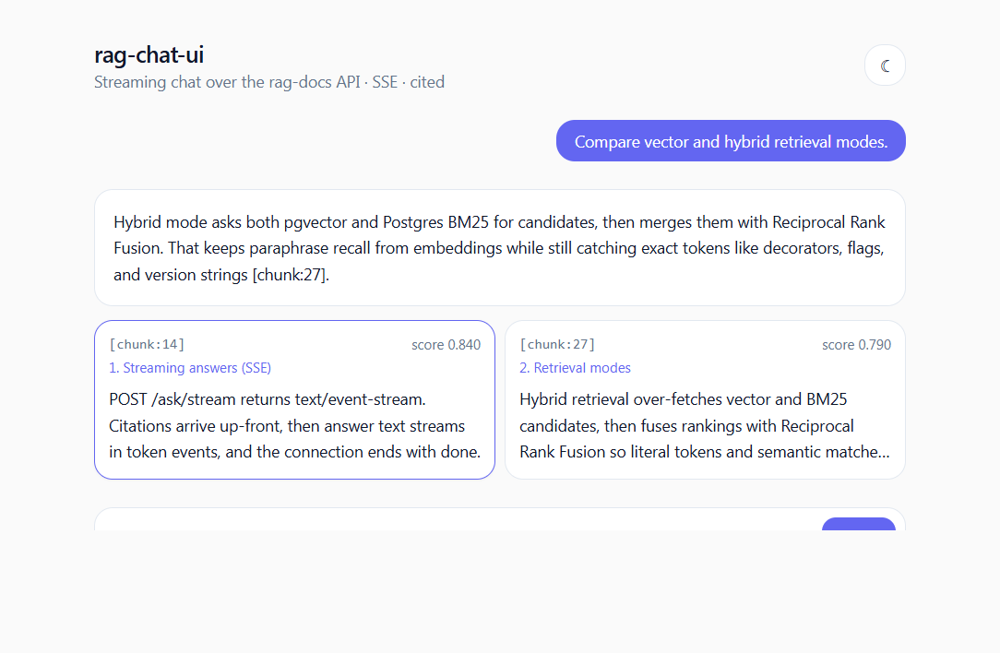

# rag-chat-ui

[](https://github.com/KassieIII/rag-chat-ui/actions/workflows/ci.yml)
[](https://nextjs.org)
[](https://react.dev)
[](https://www.typescriptlang.org)
[](https://tailwindcss.com)
[](LICENSE)
[](https://rag-chat-ui-roan.vercel.app/?demo=1)

Streaming chat UI for the [**rag-docs**](https://github.com/KassieIII/rag-docs)
RAG API. Token-by-token answers via Server-Sent Events, citations rendered
**before** the model finishes, dark mode, accessible keyboard input. Built
with **Next.js 16 + React 19** on the App Router.

> Companion frontend to my [rag-docs](https://github.com/KassieIII/rag-docs)
> Python/FastAPI backend (pgvector + hybrid BM25 retrieval, Prometheus,
> Ollama). Together they ship a self-hostable, end-to-end RAG product
> stack with no SaaS lock-in.

[](https://rag-chat-ui-roan.vercel.app/?demo=1)

The public demo runs in `?demo=1` mode, which replays a deterministic mock SSE
stream in the browser. The production path still talks to a real `rag-docs`
backend via `POST /ask/stream`.

## Why it's interesting

Most chat UIs use `EventSource`, which is GET-only and dies on
network blips. `rag-chat-ui` does it the production way:

- **POST + `fetch` + `ReadableStream`** — required because
  `/ask/stream` is a JSON POST endpoint.
- **Stateful SSE parser** that survives byte-level chunking — no
  assumption that one network frame == one event. Spec-compliant
  handling of `\r\n`, `\r`, and bare `\n` line endings, comment lines,
  multi-line `data:`, and the leading-space rule. **9 unit tests**
  pin the behaviour.
- **Citations-first rendering** — the backend emits an SSE
  `citations` event up front, so the user can read sources while the
  model is still generating tokens. The UI shows them as cards under
  the in-progress answer with a blinking caret.
- **Abortable** — pressing **Stop** calls `AbortController.abort()`,
  which cancels the underlying fetch and cleanly drops the stream.
- **Theme-flicker-free dark mode** — a tiny inline script runs before
  hydration to apply the saved/system theme, avoiding the standard
  white-flash you get with naive `useEffect` toggles.

## Stack

- Next.js 16 (App Router, Server Components by default, React 19)
- TypeScript 5 strict
- Tailwind 3.4 with CSS-variable theming
- Vitest 2 + Testing Library + happy-dom
- ESLint + Prettier (`prettier-plugin-tailwindcss`)
- GitHub Actions CI: typecheck, lint, test, build

## Quick start

```bash
# 1. install
npm ci

# 2. point at a running rag-docs instance
cp .env.example .env.local
# edit NEXT_PUBLIC_API_URL=http://localhost:8000

# 3. run
npm run dev
# open http://localhost:3000
```

Need the backend? Spin it up locally:

```bash
git clone https://github.com/KassieIII/rag-docs
cd rag-docs && docker compose up -d --build
```

### Proxy mode (for environments that block CORS)

Leave `NEXT_PUBLIC_API_URL` empty and set
`RAG_API_PROXY_TARGET=http://localhost:8000` instead. Next.js will
proxy `/api/*` to the backend — same-origin, no CORS dance.

## Architecture

```
 ┌──────────────────┐    fetch POST /ask/stream    ┌──────────────────┐
 │  React 19 App    │ ───────────────────────────► │  rag-docs API    │
 │  (App Router)    │                              │  FastAPI + SSE   │
 │                  │ ◄─── text/event-stream ───── │                  │
 │  SseParser       │   citations → token* → done  │  pgvector +      │
 │  askStream()     │                              │  hybrid BM25     │
 │  <CitationCard/> │                              │  + Ollama        │
 └──────────────────┘                              └──────────────────┘
```

Key files:

- [`src/lib/sse.ts`](src/lib/sse.ts) — pure SSE parser, fully unit-tested.
- [`src/lib/ask-stream.ts`](src/lib/ask-stream.ts) — async generator over
  `/ask/stream`, decodes citations / token / done / error events.
- [`src/app/page.tsx`](src/app/page.tsx) — chat orchestration, abort support.
- [`src/components/citation-card.tsx`](src/components/citation-card.tsx) —
  source previews, scored, links to the original document.

## Tests

```bash
npm test
```

The SSE parser tests run without a network or backend, so CI is fast
and deterministic.

## Deploying

- **Live demo**: Vercel hosts a recruiter-safe mock stream at
  <https://rag-chat-ui-roan.vercel.app/?demo=1>, no backend required.
- **Vercel**: Import the repo, set `NEXT_PUBLIC_API_URL` to a publicly
  reachable rag-docs host. Done.
- **Self-host**: `npm run build && npm start`, or `docker build` with
  the official Next.js image.

## License

MIT — see [LICENSE](LICENSE).
